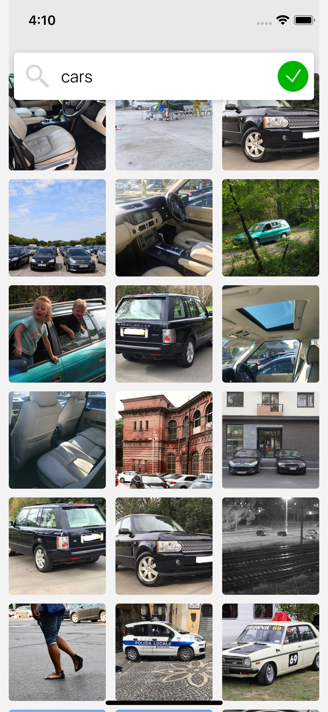

# OpenFlickrClient
----


A very basic app developed to practice and demonstrate Unit testing. 

### Screenshots




### Video


### Functionality

1. Fetches Images from Flickr Servers
2. User can search for tags
3. Images are cached in `Foundation.Cache`


### Folder Structure
```
─ OpenFlickrClient/
│   │
│   ├── Scenes
│   │	├── HUD
│   │	└── ImageSearchController [Model, View, Controller]
│   │
│	├── Extensions
│	├── Managers
│   │	├── Cache
│   │	└── Networking
│   │
│   ├── Storyboards
│	├── Resources [Assets, HTML, Fonts]
│	└── Constants [Assets, HTML, Fonts]
│   
└── OpenFlickrClientTests/
	  │   
    ├── MockData
    │	├── Json Files
    │	└── Classes to access them
    │
 	  ├── Mock Services
	  .
	  .
	  .
 	  └── Test cases files
  
  
  ```
  
  
  
  
  
  
  
